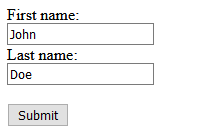
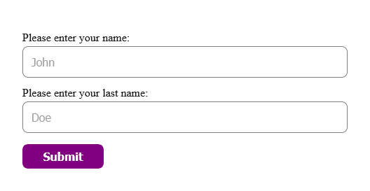
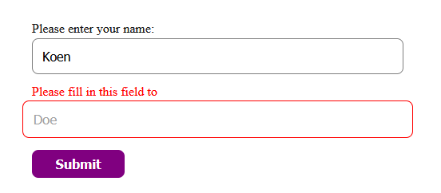

# Assignment 1 - Progressive Enhancement research

Als metafoor voor Progressive Enhancement moet je denken aan een gebouw het stale geraamte oftewel semantisch correct HTML. Dan is het beton de CSS en dan uiteindelijk is de aankleding van het gebouw (Denk aan een mooie steen) buitenkant is de Javascript. Hieruit haal ik dat progressive enhancement eigenlijk is het programmeren van websites vanuit content first.

Het geraamte (HTML) moet je semantisch correct schrijven omdat er soms apperaten etc. zijn die sommige CSS code nog niet kunnen zien. Dit betekent dat gebruikers in die situatie geen interactie kunnen hebben met je website.

Het beton (CSS) voordat je CSS gaat schrijven moet je bedenken dat je je CSS niet laat afhangen van Javascript, sommige gebruikers kunnen namelijk bepaalde Javascript dingen nog niet zien.

De mooie steen aan de buitenkant (JS) op deze manier van werken PE dus, is het een eitje om JS te schrijven. Dit allemaal om voor je gebruikers een goede ervaring op te zetten bij het gebruiken van je website.

Bij progressive enhancements heb je een paar core principles waar je je aan moet houden

-   De basis van je content moet in alle browsers zichtbaar zijn
-   Basis functionaliteiten moeten beschikbaar zijn in alle browsers (Dus ja ook IE)
-   Semantische opmaak bevat alle inhoud
-   Uitgebreide layout wordt aangeleverd door externally gelinkde CSS.
-   Uitgebreide functies wordt aangeleverd door externally gelinkde JS
-   Eind gebruiker web browser preferences worden gerespecteerd.

In 3 stappen bouwen we progressive enhancement op:

### HTML

Hier heb ik een kleine form neergezet als voorbeeld voor wat progressive enhancement doet. Hier dus een kleine form met 2 input velden en 2 labels.

### HTML + CSS

Nu ik CSS heb toegevoegd zie je dat het form al een stuk duidelijker wordt, de placeholders zijn in opacity wat omlaag zodat het er ook als een placeholder uitziet, daarnaast is het input field groter gemaakt samen met de submit knop, je ziet hier al dat de usability van dit form al een stuk beter wordt, daarnaast hebben de knoppen nu hover/focus states, zodat de toegankelijkheid een stuk beter wordt.

### HTML + CSS + JS

Nu Javascript is toegevoegd kunnen we bijvoorbeeld checken of de hele form wel is ingevuld, Hier is het laatste veld niet ingevuld en dan wordt het vel rood voordat alles verstuurd kan worden

## Resources used

-   Gustafson, A., Barth, L., Wagner, J., Gilbert, R., Nugent, L., & Patterson, M. E. (2008, 7 oktober). Understanding Progressive Enhancement. A List Apart. https://alistapart.com/article/understandingprogressiveenhancement/

-   freeCodeCamp.org. (2018, 7 november). What is Progressive Enhancement, and why it matters. https://www.freecodecamp.org/news/what-is-progressive-enhancement-and-why-it-matters-e80c7aaf834a/

-   Code Examples for Designing with Progressive Enhancement. (z.d.). Filamentgroup. Geraadpleegd op 19 mei 2021, van https://www.filamentgroup.com/dwpe/code/
