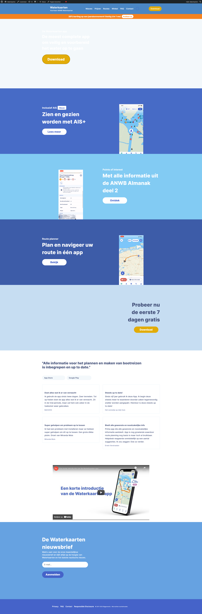
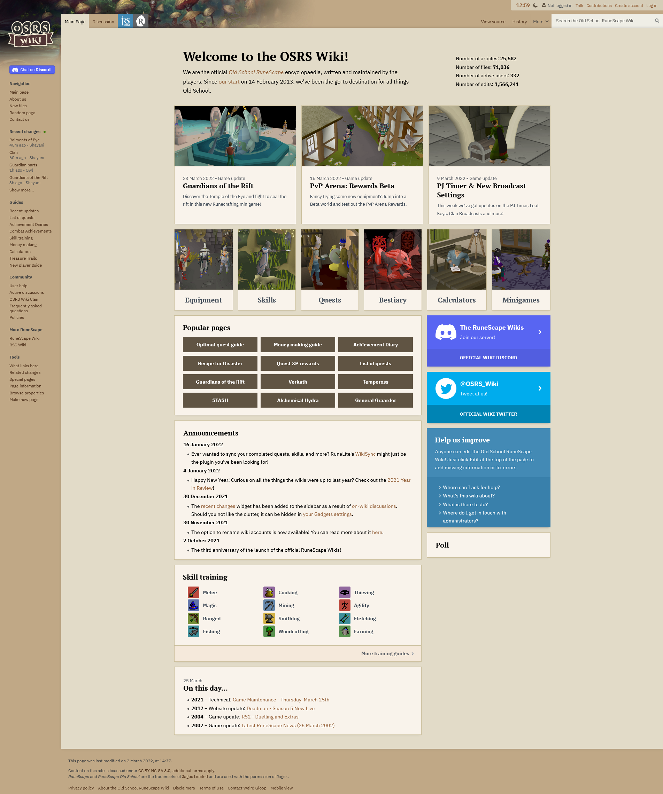
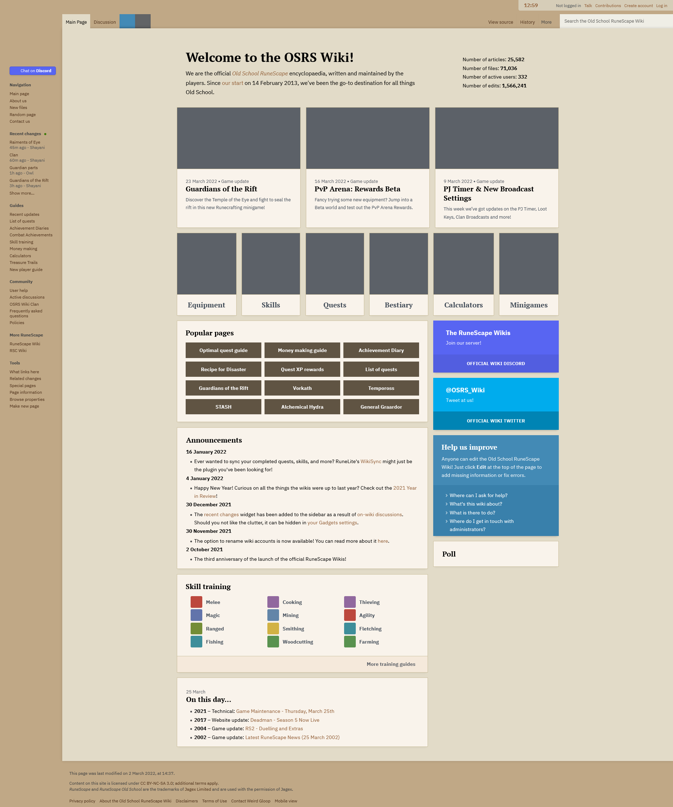

# Opdracht 2 - Breek het web

## Feature 1: Afbeeldingen uitzetten

### Problemen

Het enigste probleem dat ik kan vinden terwijl ik zoek naar cijfers van het uitzetten van afbeeldingen ben ik vooral gekomen op dat mensen hun afbeeldingen niet werken. Er wordt dus veel gezocht op waarom werken de afbeeldingen niet etc.

### Hoe kan ik dit testen

Ik kan dit testen doormiddel van deze firefox browser addon: [Web Developer](https://addons.mozilla.org/nl/firefox/addon/web-developer/)

### Aantal sites waar dit problemen oplevert

Een site waar ik dichtbij sta is: [Waterkaarten](https://waterkaarten.app/) ik heb in deze site veel uren zitten, dus een mooie test om te kijken wat dit doet:

Als ik op de knop 'hide images' klik, kan ik alle images weg halen en dat geeft dit resultaat, van: 

Naar: 

Als ik hier naar kijk schrik ik een beetje, de site waar ik al een tijdje mee aan de gang ben bestaat zoals ik weet uit heel veel afbeeldingen, zonder de afbeeldingen kan niemand zich er weg wijs maken. Toch een puntje dat ik is kan opbrengen, mocht daar tijd voor zijn.

Waar ik ook redelijk veel op zit is deze website: [Old school Runescape wiki](https://oldschool.runescape.wiki/)

Als ik op de knop 'hide images' klik, kan ik alle images weg halen en dat geeft dit resultaat: van:  

naar: 

Hieruit kan ik concluderen dat deze site nog zeker bruikbaar is als de images weg gelaten zijn, een mooi moment om tot het inzicht te komen dat alleen maar images gebruiken niet handig kan zijn.

### Hoe zou ik dit kunnen fixen

Wat ik voor mezelf zou kunnen doen is om te zorgen dat er tenminste genoeg alt's in de images staan voordat als de image breekt er tenminste staat wat er had moeten staan, ook is het denk ik belangrijk om te bedenken de tekst die wegvalt om ook zichtbaar te maken als de afbeeldingen er niet zijn. Zoals je bij [Waterkaarten](https://waterkaarten.app) ziet, zie je dat er niks meer te maken is van de website.

## Feature 6: Javascript (volledig) uitzetten

### Problemen

Als we het hebben over het uitzetten van Javascript zijn er heel veel dingen die ik denk die waarschijnlijk breken, denk bijvoorbeeld aan website die runnen op Frameworks van Javascript zoals React en Angular. Deze sites werken dan helemaal niet meer. Er zijn verschillende mensen die een voor een week een test hebben gedaan door Javascript uit te zetten, fantastisch om te lezen en misschien leuk om een keer zelf te proberen en te rapporteren, bijvoorbeeld: [Turned off javascript for a whole week and it was glorious](https://www.wired.com/2015/11/i-turned-off-javascript-for-a-whole-week-and-it-was-glorious/)

### Hoe kan ik dit testen

Via Firefox 'Geavanceerde voorkeuren':
https://www.lifewire.com/disable-javascript-in-firefox-446039
Kan ik de Javascript tijdelijk uitzetten om te kijken wat het doet.

### Aantal sites waar dit problemen oplevert

Als ik de Javascript uitzet dan geeft dat dit resultaat, van: 

Naar: 

Als ik zo kijk naar de [Waterkaarten](https://waterkaarten.app) website ben ik eigenlijk best trots, naast dat de header niet meer mooi mee scaled en kleurt en dat het YouTube inline block het niet meer doet ziet de site er nog best netjes uit, de gebruiker kan zich nog steeds weg wijs maken.
Wat me ook opvalt is dat de website gigantisch sneller laad, toch een puntje om naar te kijken.

Als ik dezelfde site gebruik zoals ik bij de images uitzet deed: [Old school Runescape wiki](https://oldschool.runescape.wiki/)

Als ik de Javascript uitzet dan geeft dat dit resultaat, van: 

Naar: 

Er breekt niks op deze website, de site is erg netjes opgebouwd dat komt dan waarschijnlijk doordat het een wiki is, de wiki zelf hoeft niet heel veel Javascript te bevatten en zo te zien is dat ook niet zo.

### Hoe zou ik dit kunnen fixen

Ik zou bij [Waterkaarten](https://waterkaarten.app) kunnen kijken naar hoe de header anders zou kunnen als er geen JS is maar daarnaast is er niet heel veel dat ik kan fixen, ik zou het YouTube veld kunnen vervangen als er niks wordt getoont, of als er een error wordt getoont. Ook de submit knop bij de newsletter lijkt wat anders gestyled te zijn, dit zou ik kunnen fixen met CSS
